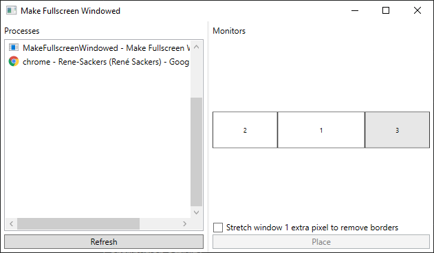

# Make Fullscreen Windowed

An old application I made that allows you to easily make any application or game full-screen borderless.

Simply select it from the list, select a monitor on the right, and click place.

